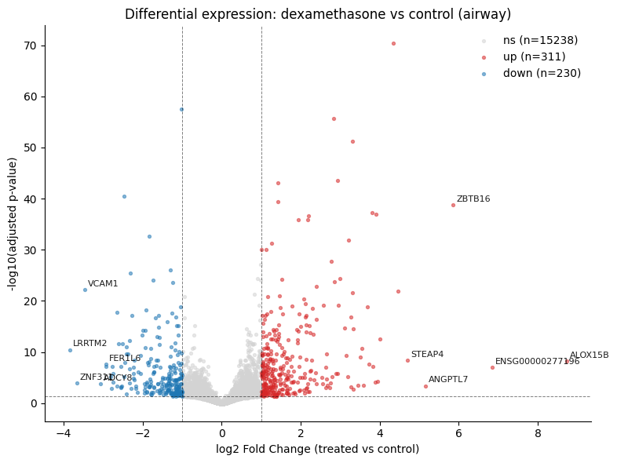
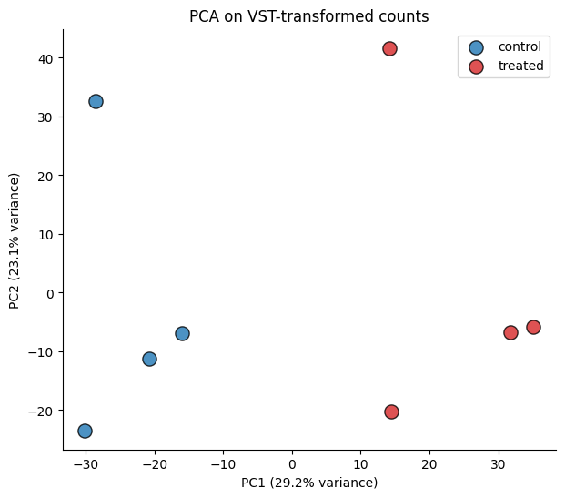

# omics-rag-playground

> An AI-assisted workbench for interpreting bulk RNA-seq differential expression results.

**Status:**  Work in progress — foundations (normalization + DE + enrichment). RAG layer and Shiny frontend coming.

---

## Motivation

Interpreting the output of a bulk RNA-seq differential expression analysis — a table of thousands of genes with log fold changes, p-values, and pathway annotations — is cognitively expensive. Biologists spend hours reading papers to contextualize a handful of candidate genes and deciding which leads to pursue. Pathway enrichment tools help, but they return more lists; they don't *explain*.

**`omics-rag-playground`** is an experimental workbench that combines a rigorous DE pipeline (powered by PyDESeq2) with retrieval-augmented generation (RAG) grounded in the primary biomedical literature. The goal is a tool that lets a researcher ask plain-language questions over their own dataset — *"which of the upregulated genes are involved in EMT, and what's the evidence?"* — and get back answers that cite the papers they come from.

This is a portfolio project, built in the open as I transition from quantum computing research into applied ML.

---

## Preview

Stage 0 warm-up on the `airway` dataset (Himes et al. 2014):

<p align="center">
  
  <br>
  <em>Volcano plot of dexamethasone vs control. Annotated genes are well-known glucocorticoid-responsive markers (ZBTB16, FKBP5, PER1, DUSP1).</em>
</p>

<p align="center">
  
  <br>
  <em>PCA on VST-transformed counts: PC1 (29.2%) cleanly separates treatment groups; PC2 (23.1%) captures donor-level variability.</em>
</p>

---

## Roadmap

- [x] **Stage 0 — Foundations**
  - Warm-up on the `airway` reference dataset
  - Repo scaffolding, dependencies pinned via `uv`
- [ ] **Stage 1 — DE analysis on a real dataset**
  - GSE50760 (colorectal cancer: primary tumor, normal mucosa, liver metastasis)
  - QC, normalization, PCA, DESeq2 run, volcano plot, top-genes heatmap
  - Pathway enrichment with `gseapy` (GSEA + ORA)
- [ ] **Stage 2 — Retrieval layer**
  - PubMed abstract ingestion (Entrez API) scoped to dataset keywords
  - Bio-aware embeddings (PubMedBERT / BioBERT) + vector store (Chroma/FAISS)
  - Gene-annotation hooks (MyGene, GeneCards)
- [ ] **Stage 3 — LLM reasoning layer**
  - LangChain pipeline with retrieval, grounded prompting, citation tracking
  - Guardrails: hallucination checks, "I don't know" fallbacks
  - Evaluation harness (retrieval precision, answer faithfulness)
- [ ] **Stage 4 — R Shiny frontend**
  - Upload dataset, configure contrasts, browse results
  - Natural-language question box wired to the LLM backend
  - Exportable HTML report per session
- [ ] **Stage 5 — Polish**
  - Dockerized deployment
  - Public demo (HuggingFace Spaces / Railway / Posit Connect)
  - Short technical write-up

---

## Getting started

### Prerequisites

- Python 3.11
- [`uv`](https://github.com/astral-sh/uv) (or your preferred Python package manager)

### Install

```bash
git clone https://github.com/emanueledri/omics-rag-playground.git
cd omics-rag-playground
uv sync
```

### Run the warm-up notebook

```bash
uv run jupyter lab notebooks/00_warmup_airway.ipynb
```

---

## Project layout

```
omics-rag-playground/
├── data/
│   └── raw/            # .gitignored — download scripts live in src/
├── notebooks/
│   ├── 00_warmup_airway.ipynb
│   └── 01_de_analysis_gse50760.ipynb
├── src/
│   └── omics_rag_playground/
├── tests/
├── pyproject.toml
└── README.md
```

---

## Tech stack

- **DE analysis:** [PyDESeq2](https://github.com/owkin/PyDESeq2), the scverse-compatible Python port of DESeq2
- **Enrichment:** [gseapy](https://github.com/zqfang/GSEApy)
- **Single-cell / AnnData interop:** [scanpy](https://scanpy.readthedocs.io/), [anndata](https://anndata.readthedocs.io/)
- **Retrieval & LLM:** LangChain, ChromaDB, sentence-transformers (planned)
- **Frontend:** R Shiny (planned)

---

## Design notes

Design decisions, trade-offs, and lessons learned will be collected in [`docs/design-notes.md`](docs/design-notes.md) as the project evolves. The notes are written as I go and may contain dead ends — the point is the trail, not a polished retrospective.

---

## About

Built by [Emanuele Dri](https://www.linkedin.com/in/emanuele-dri/) — PhD in quantum computing, currently pivoting toward AI/ML. See also: [Google Scholar](https://scholar.google.com/citations?user=4Xb0ikoAAAAJ&hl=en).

## License

MIT