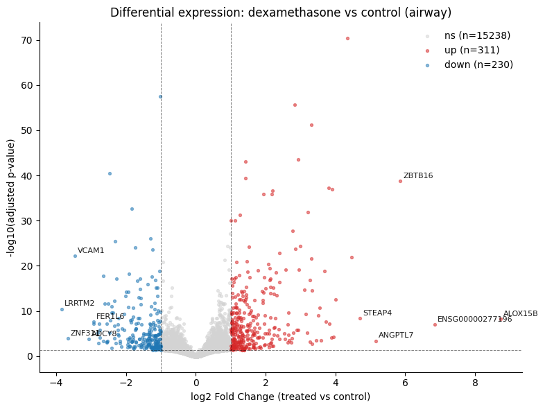
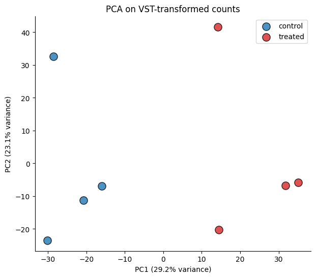
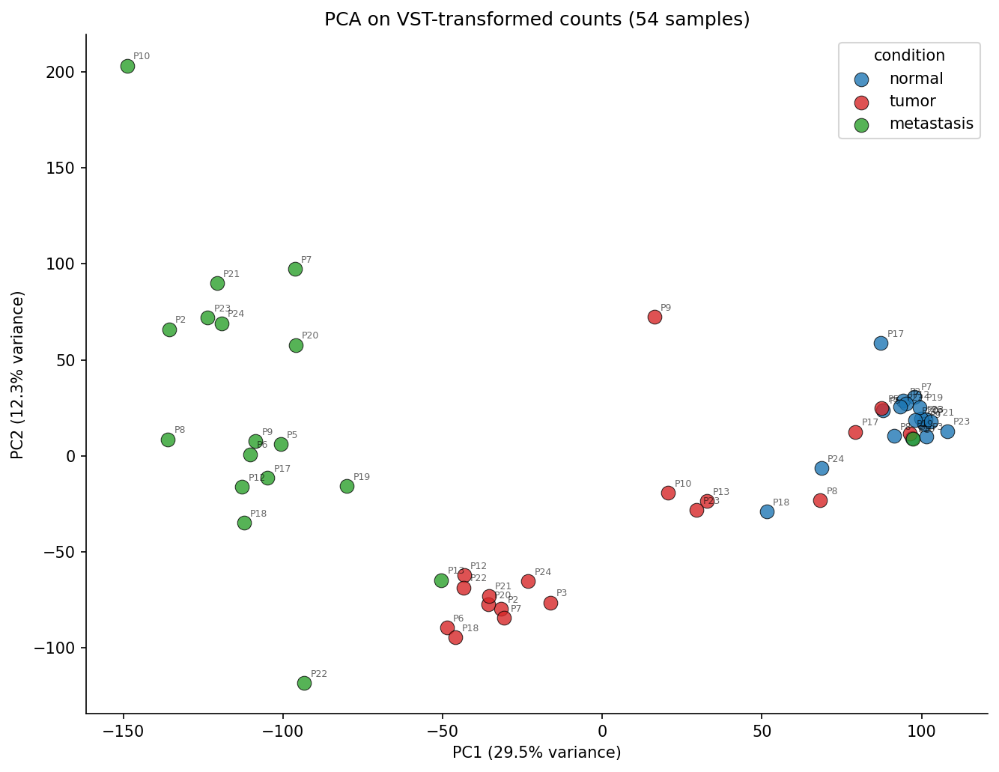
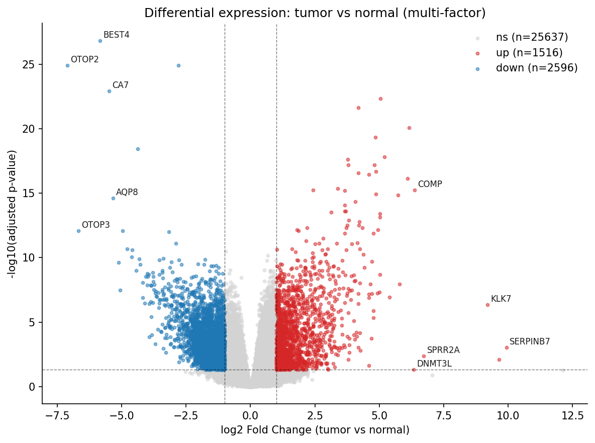

# omics-rag-playground

> An AI-assisted workbench for interpreting bulk RNA-seq differential expression results.

**Status:** Work in progress. Foundations (normalization, DE, enrichment) and the RAG layer (retrieval, reasoning with citations) are in place. R Shiny frontend coming.

---

## Motivation

Interpreting the output of a bulk RNA-seq differential expression analysis, a table of thousands of genes with log fold changes, p-values, and pathway annotations, is cognitively expensive. Biologists spend hours reading papers to contextualize a handful of candidate genes and deciding which leads to pursue. Pathway enrichment tools help, but they return more lists; they don't *explain*.

**`omics-rag-playground`** is an experimental workbench that combines a rigorous DE pipeline (powered by PyDESeq2) with retrieval-augmented generation (RAG) grounded in the primary biomedical literature. The goal is a tool that lets a researcher ask plain-language questions over their own dataset, such as *"which of the upregulated genes are involved in EMT, and what's the evidence?"*, and get back answers that cite the papers they come from.

This is a portfolio project, built in the open as I transition from quantum computing research into applied ML.

---

## Preview

**Stage 0 warm-up on the `airway` dataset** (Himes et al. 2014):

<p align="center">
  
  <br>
  <em>Volcano plot of dexamethasone vs control.</em>
</p>

<p align="center">
  
  <br>
  <em>PCA on VST-transformed counts: PC1 (29.2%) cleanly separates treatment groups; PC2 (23.1%) captures donor-level variability.</em>
</p>

**Stage 1, colorectal cancer DE on GSE50760** (Kim et al. 2014, via recount3):

<p align="center">
  
  <br>
  <em>PCA on VST counts. PC1 separates colon-derived from liver-derived samples; tumor and normal overlap within the colon cluster, motivating the multi-factor design.</em>
</p>

<p align="center">
  
  <br>
  <em>Tumor vs normal under <code>~patient + condition</code>. The downregulated colonic-differentiation markers (BEST4, OTOP2, CA7) emerge as top hits, masked by the simpler design.</em>
</p>

---

## Roadmap

- [x] **Stage 0, Foundations**
  - Warm-up on the `airway` reference dataset
  - Repo scaffolding, dependencies pinned via `uv`
- [x] **Stage 1, DE analysis on a real dataset**
  - GSE50760 (colorectal cancer: primary tumor, normal mucosa, liver metastasis) via recount3
  - Single-factor and multi-factor (`~patient + condition`) designs in parallel
  - Volcano plots, exploratory PCA on VST counts, pathway enrichment (Hallmarks)
  - Documented liver-tissue confound in the metastasis-vs-tumor contrast
- [x] **Stage 2, Retrieval layer**
  - PubMed abstract ingestion via Biopython Entrez, cached by PMID
  - Bio-aware embeddings (NeuML/pubmedbert-base-embeddings, 768-dim, L2-normalized)
  - Persistent ChromaDB vector store with cosine space
  - MeSH ablation documented as null result (dropped MeSH appending for Stage 3)
- [x] **Stage 3, LLM reasoning layer** *(partial)*
  - LangChain integration with Claude Haiku 4.5 via `langchain-anthropic`
  - Structured output (Pydantic `GroundedAnswer`) with answer, citations, confidence, reasoning_type
  - System prompt enforcing grounding-from-abstracts-only and explicit "no evidence" fallbacks
  - Literature-sparse fallback that short-circuits the LLM when retrieved distances exceed a calibrated threshold
  - Three-question demo notebook covering topic, function, and mechanism reasoning
  - **Pending:** evaluation harness on benchmark questions (Session 5)
- [ ] **Stage 4, R Shiny frontend**
  - Upload dataset, configure contrasts, browse results
  - Natural-language question box wired to the LLM backend
  - Exportable HTML report per session
- [ ] **Stage 5, Polish**
  - Dockerized deployment
  - Public demo (HuggingFace Spaces / Railway / Posit Connect)
  - Short technical write-up

---

## Getting started

### Prerequisites

- Python 3.11
- [`uv`](https://github.com/astral-sh/uv) (or your preferred Python package manager)
- An [Anthropic API key](https://console.anthropic.com/) for Stage 3 (the rest of the project runs offline)

### Install

```bash
git clone https://github.com/emanueledri/omics-rag-playground.git
cd omics-rag-playground
uv sync
cp .env.example .env  # then fill in NCBI_EMAIL, NCBI_API_KEY, ANTHROPIC_API_KEY
```

### Run the warm-up notebook

```bash
uv run jupyter lab notebooks/00_warmup_airway.ipynb
```

### Run the reasoning demo

```bash
uv run jupyter lab notebooks/03_reasoning_demo.ipynb
```
Note: the reasoning demo expects a populated ChromaDB collection from Stage 2. Run notebook 02 first to populate `data/processed/chroma_db/`.

---

## Project layout

```
omics-rag-playground/
├── data/
│   └── raw/            # .gitignored — download scripts live in src/
├── notebooks/
│   ├── 00_warmup_airway.ipynb
│   └── 01_de_analysis_gse50760.ipynb
├── src/
│   └── omics_rag_playground/
├── tests/
├── pyproject.toml
└── README.md
```

---

## Tech stack

- **DE analysis:** [PyDESeq2](https://github.com/owkin/PyDESeq2), the scverse-compatible Python port of DESeq2
- **Enrichment:** [gseapy](https://github.com/zqfang/GSEApy)
- **Single-cell / AnnData interop:** [scanpy](https://scanpy.readthedocs.io/), [anndata](https://anndata.readthedocs.io/)
- **PubMed retrieval:** [Biopython](https://biopython.org/) Entrez
- **Embeddings & vector store:** [sentence-transformers](https://www.sbert.net/), [ChromaDB](https://www.trychroma.com/)
- **LLM reasoning:** [LangChain](https://www.langchain.com/), Anthropic Claude Haiku 4.5
- **Frontend:** R Shiny (planned)

---

## Design notes

Design decisions, trade-offs, and lessons learned are collected in [`docs/design-notes.md`](docs/design-notes.md), updated per session as the project evolves. The notes are written as I go and may contain dead ends; the point is the trail, not a polished retrospective.

---

## About

Built by [Emanuele Dri](https://www.linkedin.com/in/emanuele-dri/) — PhD in quantum computing, currently pivoting toward AI/ML. See also: [Google Scholar](https://scholar.google.com/citations?user=4Xb0ikoAAAAJ&hl=en).

## License

MIT
